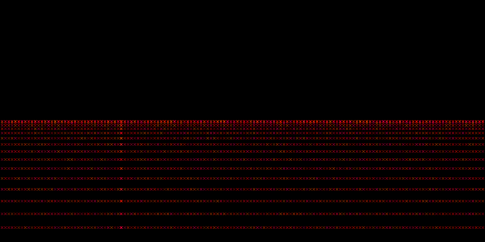
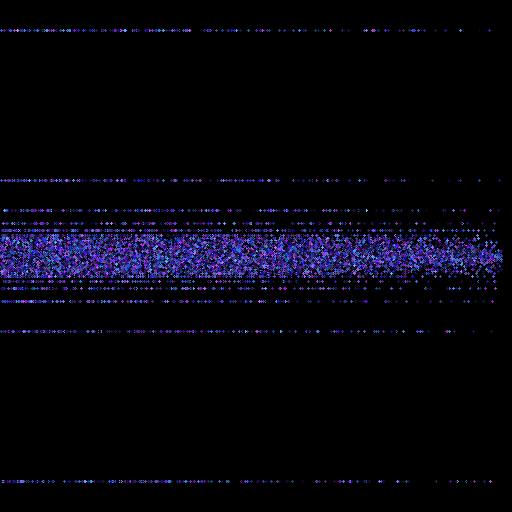
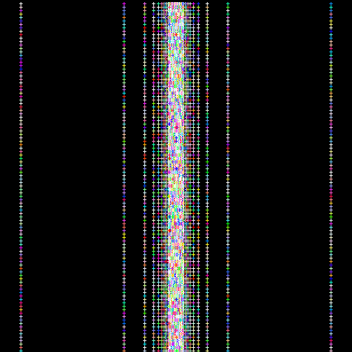
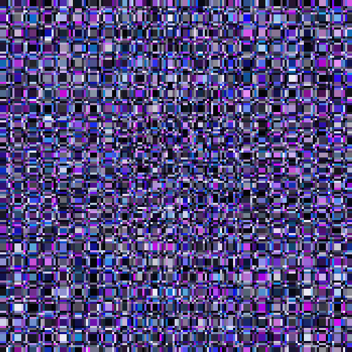

# Generate

A JavaFX program that uses mathematical functions and other parameters to populate a grid. Check out [a few of my pieces created with this program](https://juliencherry.net/generate/) on my website or play around with it yourself!

## Samples

Here are some sample images:

There are also more sample images in the [`img` directory](img).
